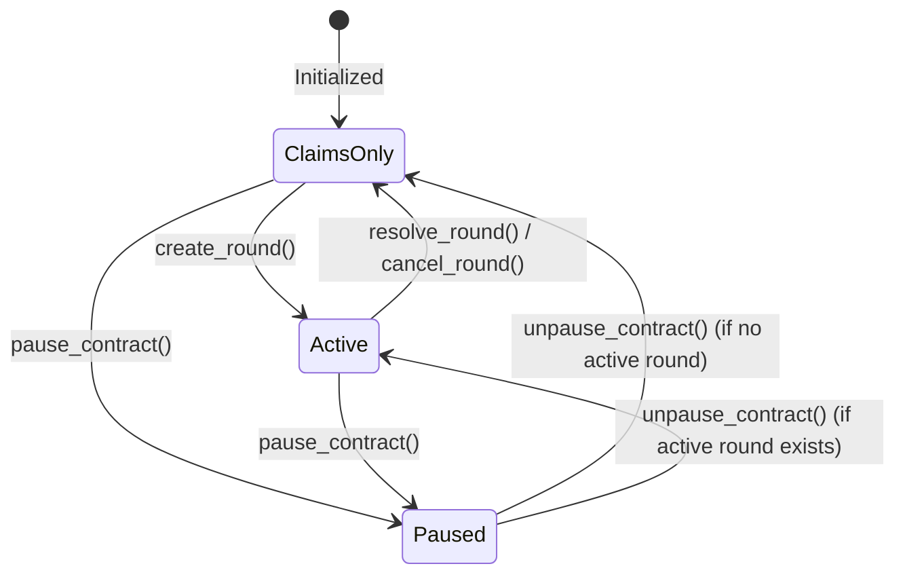
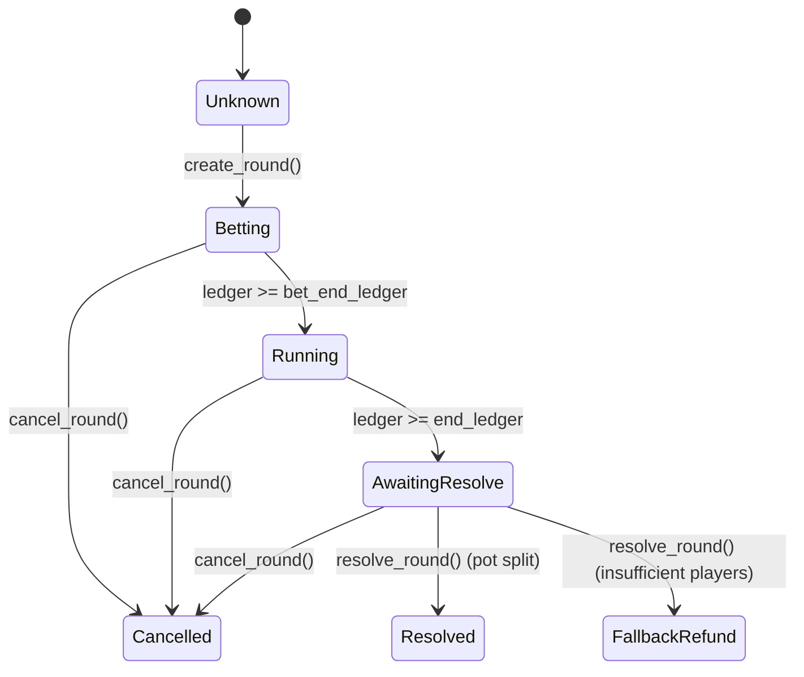

# Round Lifecycle

## States

```
                    ┌─────────────┐
                    │   Settled   │ ◄─────────────────────────────────┐
                    └─────────────┘                                    │
                           │                                           │
              create_round (admin)                          resolve_round (oracle)
                           │                                           │
                           ▼                                           │
                    ┌─────────────┐                                    │
                    │   Active    │ ───────────────────────────────────┘
                    └─────────────┘
                    Bet window open
                    (ledger < bet_end_ledger)
                           │
                    bet window closes
                    (ledger ≥ bet_end_ledger)
                           │
                    Run window closes
                    (ledger ≥ end_ledger)
```

## Single-Active-Round Invariant

**At most one round may be in the Active state at any point in time.**

This is enforced by `assert_no_active_round`, a guard helper called at the
start of `create_round`, before any storage writes:

```rust
fn assert_no_active_round(env: &Env) -> Result<(), ContractError> {
    if env.storage().persistent().has(&DataKey::ActiveRound) {
        return Err(ContractError::RoundAlreadyActive);
    }
    Ok(())
}
```

If an active round is detected the function returns `ContractError::RoundAlreadyActive`
immediately. No storage keys are mutated — the round counter (`LastRoundId`)
and the existing `ActiveRound` entry both remain unchanged.

## Entrypoints That Enforce the Guard

| Entrypoint | Guard applied |
|---|---|
| `create_round` | `assert_no_active_round` before any write |

Any future entrypoint that could create a round must also call
`assert_no_active_round` before touching storage.

## Error Mapping

| Rust variant | Code | TypeScript message |
|---|---|---|
| `ContractError::RoundAlreadyActive` | 20 | `"RoundAlreadyActive"` |

## Storage Keys Affected by the Guard

| Key | Written on success | Written on failure |
|---|---|---|
| `DataKey::ActiveRound` | ✅ New round struct | ❌ Unchanged |
| `DataKey::LastRoundId` | ✅ Incremented | ❌ Unchanged |
| `DataKey::UpDownPositions` | ✅ Cleared | ❌ Unchanged |
| `DataKey::PrecisionPositions` | ✅ Cleared | ❌ Unchanged |

## Round Resolution

The oracle calls `resolve_round` after `end_ledger` is reached. On success:
- `ActiveRound` is removed — the invariant is reset and a new round can be created.
- Participant positions (`UpDownPositions`, `PrecisionPositions`) are removed.
- Pending winnings for winners are written to `PendingWinnings(address)`.

## Claiming Winnings

Users call `claim_winnings` any time after a round resolves. The pending amount
is added to their balance and the `PendingWinnings` entry is removed atomically.

## Protocol and Round Statuses

The contract exposes two explicit status query endpoints for clients to monitor the protocol and round states:
- `get_protocol_status()` returns `ProtocolStatus`.
- `get_round_status(round_id)` returns `RoundStatus`.

### ProtocolStatus

The global protocol state is represented by the `ProtocolStatus` enum:

| Variant | Value | Description |
|---|---|---|
| `Active` | `0` | The contract is not paused and has a currently active round. |
| `Paused` | `1` | The contract is emergency-paused by the admin. |
| `ClaimsOnly` | `2` | The contract is not paused, but no round is active. Mutating actions are limited to claiming pending winnings. |



### RoundStatus

The status of any specific round (queried by its monotonic `round_id`) is represented by the `RoundStatus` enum:

| Variant | Value | Description |
|---|---|---|
| `Unknown` | `0` | The round does not exist, or has been pruned from the archive. |
| `Betting` | `1` | The round is active and open for betting / predictions (`ledger < bet_end_ledger`). |
| `Running` | `2` | Betting is closed, but the round is still running (`bet_end_ledger <= ledger < end_ledger`). |
| `AwaitingResolve` | `3` | The round has ended and is waiting for oracle resolution (`ledger >= end_ledger`). |
| `Resolved` | `4` | The round has been resolved normally (pot distributed to winners). |
| `Cancelled` | `5` | The round was cancelled by the admin (stakes refunded). |
| `FallbackRefund` | `6` | The round failed to meet minimum participants and was refunded at settlement. |



---

## Related

- [`docs/STATUS_CODES.md`](docs/STATUS_CODES.md) — Full status code reference with Mermaid transition diagrams,
  TypeScript usage examples, and the interaction matrix between `ProtocolStatus` and `RoundStatus`.
- [`docs/EVENT_SCHEMA.md`](docs/EVENT_SCHEMA.md) — On-chain events emitted at each lifecycle transition.
