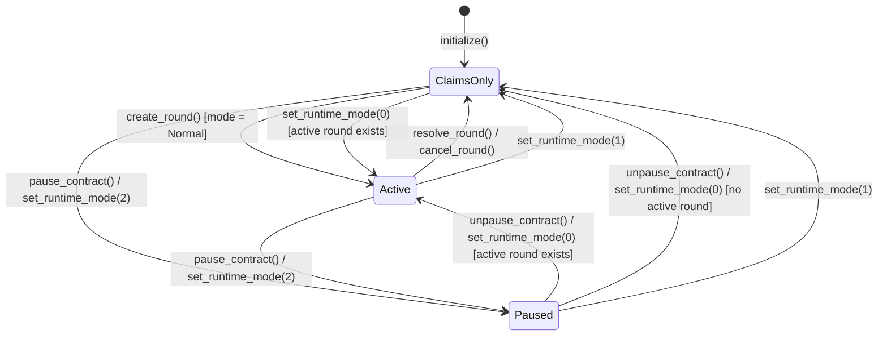
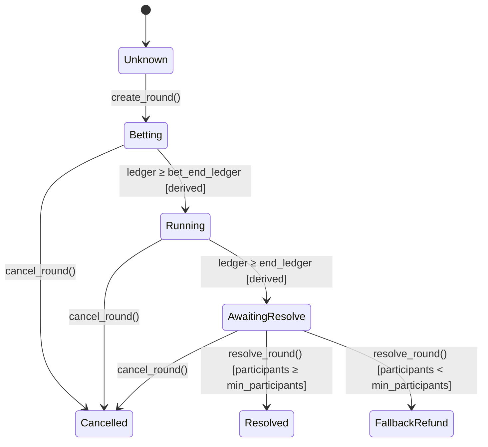

# Status Codes Reference

> **Issue #199** — Explicit user-facing status codes for paused / claims-only / cancelled states.

This document is the canonical reference for every status surface exposed by
the Xelma protocol: `get_runtime_mode()`, `is_paused()`, `get_protocol_status()`,
`get_round_status()` and `get_protocol_health()`.

Frontends and monitoring dashboards should use these endpoints instead of
combining multiple boolean flags.

---

## Canonical status table (Issue #567)

`RuntimeMode` (stored under `DataKeyCore::Paused`) is the **single source of
truth**. Every other global status is a pure projection of it plus "is a round
active". The word *paused* means exactly one thing everywhere:
`RuntimeMode::FullyPaused`.

| `get_runtime_mode()` | Active round? | `is_paused()` | `get_protocol_status()` | `health.paused` | `health.status_code` ¹ | Bets / reveals | Claims | Settle / cancel | Admin config |
|----------------------|:-------------:|:-------------:|-------------------------|:---------------:|------------------------|:--------------:|:------:|:---------------:|:------------:|
| `0` `Normal`         | no            | `false`       | `ClaimsOnly` (2)        | `false`         | `4` `NO_ACTIVE_ROUND`   | ❌ ²                 | ✅     | ✅              | ✅           |
| `0` `Normal`         | yes           | `false`       | `Active` (0)            | `false`         | `0` `HEALTHY`           | ✅                   | ✅     | ✅              | ✅           |
| `1` `ClaimsOnly`     | no            | `false`       | `ClaimsOnly` (2)        | `false`         | `6` `CLAIMS_ONLY`       | ❌                   | ✅     | ✅              | ✅           |
| `1` `ClaimsOnly`     | yes           | `false`       | `ClaimsOnly` (2)        | `false`         | `6` `CLAIMS_ONLY`       | ❌                   | ✅     | ✅              | ✅           |
| `2` `FullyPaused`    | no            | `true`        | `Paused` (1)            | `true`          | `1` `PAUSED`            | ❌                   | ❌     | ❌              | ❌ ³         |
| `2` `FullyPaused`    | yes           | `true`        | `Paused` (1)            | `true`          | `1` `PAUSED`            | ❌                   | ❌     | ❌              | ❌ ³         |

¹ Assuming a live oracle and a round that is not past `end_ledger`; see
[Status precedence](#status-precedence) for how degradations combine.
² No round to act on (`NoActiveRound`), not a policy block. Other round-mutation entrypoints such as `mint_initial` pass the gate in every `Normal` row and are blocked in the other modes.
³ `set_runtime_mode` / `pause_contract` / `unpause_contract` stay callable so the admin can leave the paused state.

Invariants (enforced by `tests::status::test_status_matrix_matches_runtime_mode_and_policy_gate`):

- `get_protocol_status() == Paused` ⇔ `is_paused()` ⇔ `health.paused` ⇔ claims are blocked.
- `get_protocol_status() == Active` ⇔ round mutations pass the policy gate.
- `pause_contract()` and `set_runtime_mode(2)` produce identical output on every surface.
- `get_round_status()` never depends on `RuntimeMode`; it only reflects the round's own lifecycle.

---

## `get_protocol_status()` → `ProtocolStatus`

Returns the **global** state of the protocol. Only one of the three variants is
ever active at a given moment.

### Status Codes

| Value | Variant      | Meaning                                                                                     |
|-------|--------------|---------------------------------------------------------------------------------------------|
| `0`   | `Active`     | `RuntimeMode::Normal` **and** a round is active; bets / reveals accepted.                   |
| `1`   | `Paused`     | `RuntimeMode::FullyPaused`; every mutation blocked, including claims.                        |
| `2`   | `ClaimsOnly` | `RuntimeMode::ClaimsOnly` (with or without a round), or `Normal` with no active round.      |

> **Priority rule**: `Paused` is returned first regardless of round state, then
> `ClaimsOnly` mode, then round presence. A `ClaimsOnly` incident with a live
> round reports `ClaimsOnly`, never `Active`. The round's own
> `get_round_status()` keeps reflecting its temporal phase in every mode.

### Transition Diagram



### Frontend State Machine Notes

- Poll `get_protocol_status()` on page load to gate the entire UI.
- Render a full-screen pause banner when `Paused` is returned.
- Disable all bet/prediction UI and `create_round` controls when `ClaimsOnly`.
- Enable full UI when `Active`.

---

## `get_round_status(round_id)` → `RoundStatus`

Returns the **per-round** lifecycle state identified by its monotonic `round_id`.
Covers all stages from creation through terminal settlement.

### Status Codes

| Value | Variant           | Meaning                                                                         |
|-------|-------------------|---------------------------------------------------------------------------------|
| `0`   | `Unknown`         | Round does not exist or was pruned from the on-chain archive.                   |
| `1`   | `Betting`         | Active; bets and predictions accepted (`ledger < bet_end_ledger`).              |
| `2`   | `Running`         | Betting closed; reveal window open (`bet_end_ledger ≤ ledger < end_ledger`).    |
| `3`   | `AwaitingResolve` | Round ended; awaiting oracle call (`ledger ≥ end_ledger`).                      |
| `4`   | `Resolved`        | Oracle settled normally; pot distributed to winners.                            |
| `5`   | `Cancelled`       | Admin cancelled; all stakes refunded.                                           |
| `6`   | `FallbackRefund`  | Settled with fewer participants than `min_participants`; all stakes refunded.   |
| `7`   | `Voided`          | Dispute window voided the staged result; all stakes refunded.                   |

> **Derived states**: `Betting`, `Running`, and `AwaitingResolve` are computed
> from the current ledger sequence compared to the round's ledger bounds — they
> do not involve additional on-chain storage writes.

> **Archive pruning**: Pruning a terminal round from the on-chain archive
> (FIFO, controlled by `archive_retention`) deletes both its
> `ArchivedRoundSummary` and its `CancelledRound` marker, so
> `get_round_status()` returns `Unknown` for every pruned round, cancelled or
> not. The marker lookup only matters for legacy rounds cancelled before
> archiving existed. Integrate event indexing for long-term historical queries.

### Transition Diagram



### Lookup Priority in `get_round_status()`

The implementation resolves the status in the following order:

1. **Active round** — If `round_id` matches the current active round, derive
   `Betting` / `Running` / `AwaitingResolve` from ledger position.
2. **Archive** — If an `ArchivedRoundSummary` exists, map its
   `RoundArchiveStatus` to `Resolved`, `Cancelled`, `FallbackRefund`, or `Voided`.
3. **Cancelled marker** — If a `CancelledRound` flag exists (legacy rounds
   with no archive entry), return `Cancelled`.
4. **Unknown** — The round was never created, or the archive entry was pruned
   and no cancelled marker exists.

### Frontend State Machine Notes

- Use `Betting` to enable the bet / commit prediction widgets.
- Use `Running` to show the "reveal prediction" UI (Precision mode).
- Use `AwaitingResolve` to show an "awaiting oracle" spinner.
- Use `Resolved` / `Cancelled` / `FallbackRefund` / `Voided` to show results and enable claiming.
- Use `Unknown` to show a 404-style "round not found" message.

---

## Interaction Between `ProtocolStatus` and `RoundStatus`

The two codes are **independent** of each other: `ProtocolStatus` follows
`RuntimeMode`, `RoundStatus` follows the ledger.

| `ProtocolStatus` | `RoundStatus` for active round | Interpretation                                      |
|------------------|---------------------------------|-----------------------------------------------------|
| `Paused`         | `Betting`                       | Contract is paused; round's bet phase will resume when unpaused. |
| `Paused`         | `Running`                       | Contract is paused; reveal window will resume when unpaused.     |
| `Paused`         | `AwaitingResolve`               | Contract is paused; oracle cannot settle until unpaused.         |
| `ClaimsOnly`     | `Betting` / `Running`           | ClaimsOnly incident mode; bets/reveals blocked, admin may cancel. |
| `ClaimsOnly`     | `AwaitingResolve`               | ClaimsOnly incident mode; oracle may still settle the round.     |
| `Active`         | `Betting`                       | Nominal: bets open.                                 |
| `Active`         | `Running`                       | Nominal: reveals open.                              |
| `Active`         | `AwaitingResolve`               | Stale round: oracle settlement overdue.             |
| `ClaimsOnly`     | `Resolved`                      | Normal idle state after settlement.                 |
| `ClaimsOnly`     | `Cancelled`                     | Round was cancelled; users may claim refunds.       |
| `ClaimsOnly`     | `FallbackRefund`                | Round failed minimum participants; users may claim. |

---

## `get_protocol_health()` → `ProtocolHealthStatus`

Returns a composite snapshot of overall protocol health, designed for operator monitoring dashboards, Nagios-compatible probes, and CI smoke gates.

### Health Status Codes (`status_code`)

| Value | Label               | Severity | Meaning                                                                   |
|:-----:|---------------------|:--------:|---------------------------------------------------------------------------|
| `0`   | `HEALTHY`           | OK       | All subsystems nominal: oracle live, not paused, active round healthy.    |
| `1`   | `PAUSED`            | CRIT     | Emergency-paused via `FullyPaused` runtime mode; mutations blocked.       |
| `2`   | `ORACLE_STALE`      | WARN     | Oracle heartbeat timestamp exceeds stale threshold or status is offline. |
| `3`   | `ROUND_STALE`       | WARN     | Active round is past its `end_ledger` and awaiting oracle resolution.     |
| `4`   | `NO_ACTIVE_ROUND`   | OK       | Idle state: no active round, but oracle is live and contract is normal.   |
| `5`   | `MULTIPLE_ISSUES`   | CRIT     | Two or more degradation conditions detected simultaneously.               |
| `6`   | `CLAIMS_ONLY`       | WARN     | Protocol in `ClaimsOnly` runtime mode; round mutations blocked.           |
| `7`   | `ACCESS_RESTRICTED` | INFO     | Allowlist access control is enabled; everything else is healthy.          |

`health.paused` is `true` **only** in `FullyPaused` (identical to `is_paused()`).
`ClaimsOnly` is never reported through `paused`; read `status_code == 6`.

### Status precedence

The first matching row wins:

| Order | Condition                                              | `status_code`            |
|:-----:|--------------------------------------------------------|--------------------------|
| 1     | `RuntimeMode::FullyPaused`                             | `1` `PAUSED`             |
| 2     | Two or more of: ClaimsOnly mode, oracle not live, round past `end_ledger` | `5` `MULTIPLE_ISSUES` |
| 3     | `RuntimeMode::ClaimsOnly`                              | `6` `CLAIMS_ONLY`        |
| 4     | Oracle heartbeat stale / offline / missing             | `2` `ORACLE_STALE`       |
| 5     | Active round past `end_ledger`                         | `3` `ROUND_STALE`        |
| 6     | No active round                                        | `4` `NO_ACTIVE_ROUND`    |
| 7     | Allowlist access control enabled                       | `7` `ACCESS_RESTRICTED`  |
| 8     | Otherwise                                              | `0` `HEALTHY`            |

A `ClaimsOnly` incident therefore never hides a stale oracle or stale round: the
combination escalates to `MULTIPLE_ISSUES`.

---

## `RuntimeMode` Entrypoint Policy Matrix

The contract defines three operational runtime modes (`Normal`, `ClaimsOnly`, `FullyPaused`), enforced centrally via `_policy_gate`:

| Entrypoint Category | `Normal` (0) | `ClaimsOnly` (1) | `FullyPaused` (2) | Examples / Methods                                                                                    |
|---------------------|:------------:|:----------------:|:-----------------:|-------------------------------------------------------------------------------------------------------|
| **RoundMutation**   | ✅ Allowed   | ❌ Blocked       | ❌ Blocked        | `place_bet`, `place_precision_prediction`, `predict_price`, `commit_prediction`, `reveal_prediction`, `mint_initial`, `cash_out_early` |
| **Claim**           | ✅ Allowed   | ✅ Allowed       | ❌ Blocked        | `claim_winnings`                                                                                      |
| **Settlement**      | ✅ Allowed   | ✅ Allowed       | ❌ Blocked        | `resolve_round`, `resolve_round_multi`, `cancel_round`                                                |
| **AdminConfig**     | ✅ Allowed   | ✅ Allowed       | ❌ Blocked        | `create_round`, `set_windows`, `set_oracle_max_deviation_bps`, etc.                                   |
| **Mode control**    | ✅ Allowed   | ✅ Allowed       | ✅ Allowed        | `set_runtime_mode`, `pause_contract`, `unpause_contract` (admin; not gated so the admin can exit)   |
| **Read-Only / Hb**  | ✅ Allowed   | ✅ Allowed       | ✅ Allowed        | `update_oracle_heartbeat`, `get_protocol_health`, `get_protocol_status`, `balance`, `get_*`           |

---

## TypeScript Usage

```typescript
import { Client, ProtocolStatus, RoundStatus } from '@xelma/bindings';

const client = new Client({ /* ... */ });

// Single-call protocol gate
const protocolStatus = (await client.get_protocol_status()).result;
if (protocolStatus === ProtocolStatus.Paused) {
  showPauseBanner();
} else if (protocolStatus === ProtocolStatus.ClaimsOnly) {
  showClaimsOnlyBanner();
}

// Round status for a specific round
const roundStatus = (await client.get_round_status({ round_id: BigInt(42) })).result;
switch (roundStatus) {
  case RoundStatus.Betting:
    showBetWidget();
    break;
  case RoundStatus.Running:
    showRevealWidget();
    break;
  case RoundStatus.AwaitingResolve:
    showAwaitingOracleSpinner();
    break;
  case RoundStatus.Resolved:
  case RoundStatus.Cancelled:
  case RoundStatus.FallbackRefund:
    showResultsAndClaimWidget();
    break;
  case RoundStatus.Unknown:
    showRoundNotFound();
    break;
}
```

---

## Related

- [`ROUND_LIFECYCLE.md`](../ROUND_LIFECYCLE.md) — Round lifecycle invariants and resolution logic.
- [`docs/EVENT_SCHEMA.md`](EVENT_SCHEMA.md) — On-chain events emitted at each lifecycle transition.
- [`contracts/src/types.rs`](../contracts/src/types.rs) — Rust enum definitions.
- [`bindings/src/index.ts`](../bindings/src/index.ts) — TypeScript bindings.
